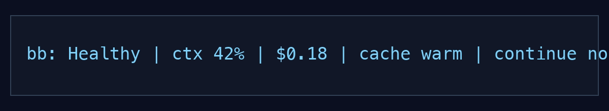

# bb-cc-lite

[](https://github.com/softcane/bb-cc-lite/actions/workflows/ci.yml)

Claude Code can look busy while it is doing the wrong thing: retrying the same broken test, editing without checking, filling context, or spending money on a stuck loop.

`bb-cc-lite` adds a small status line that answers one question:

> Should I let this Claude Code session keep going?



## Requirements

- Node.js 20 or newer
- Claude Code with status line support

## Install

```bash
npx --yes bb-cc-lite install --scope local --hooks
```

Restart Claude Code in the project. The status line appears at the bottom.

Install preserves an existing Claude Code `statusLine` unless you pass `--replace`. `--hooks` is optional, but gives faster loop detection.

To uninstall:

```bash
npx --yes bb-cc-lite uninstall --scope local
```

Prefer a global install?

```bash
npm install -g bb-cc-lite
bb-cc-lite install --scope local --hooks
```

To replace an existing status line:

```bash
npx --yes bb-cc-lite install --scope local --replace --hooks
```

## What It Catches

- Retry loops where the same command or test fails repeatedly without a fix.
- Long stretches of editing without a test, lint, typecheck, or build check.
- Context pressure before the session gets too full to reason clearly.
- Cost and cache signals that make a stuck session easier to spot.

## What It Shows

```text
bb: Healthy | ctx 42% | $0.18 | cache warm | continue normally
bb: Careful | edits have not been checked yet | ask Claude to run the smallest relevant check
bb: Careful | same test failed twice without a fix | inspect first failure
bb: Careful | tests failed twice; usually passes after one targeted fix | inspect first failure
bb: Stop | why: same failure retried 3x without a fix | do: stop and inspect first failure
bb: Stop | why: test loop rarely recovered after 3 failures | do: stop retrying and inspect first failure
```

`Healthy` means keep going. `Careful` means slow down and verify. `Stop` means take over before Claude burns more turns.

## Useful Commands

```bash
bb-cc-lite why
bb-cc-lite doctor
bb-cc-lite uninstall --scope local
```

`why` explains the latest statusline decision. `doctor` checks the install. `uninstall` restores the previous Claude Code status line when a backup exists.

## Privacy

Everything stays local. `bb-cc-lite` does not upload transcripts, prompts, tool output, shell output, file contents, API keys, or raw Claude session ids.

It stores derived data only: counts, rates, percentiles, confidence labels, reason codes, cost/context numbers, weak pattern labels, and hashed session keys.

LiteLLM is used only as public pricing data for cost estimates. `bb-cc-lite` does not run a proxy, gateway, dashboard, or message router.
